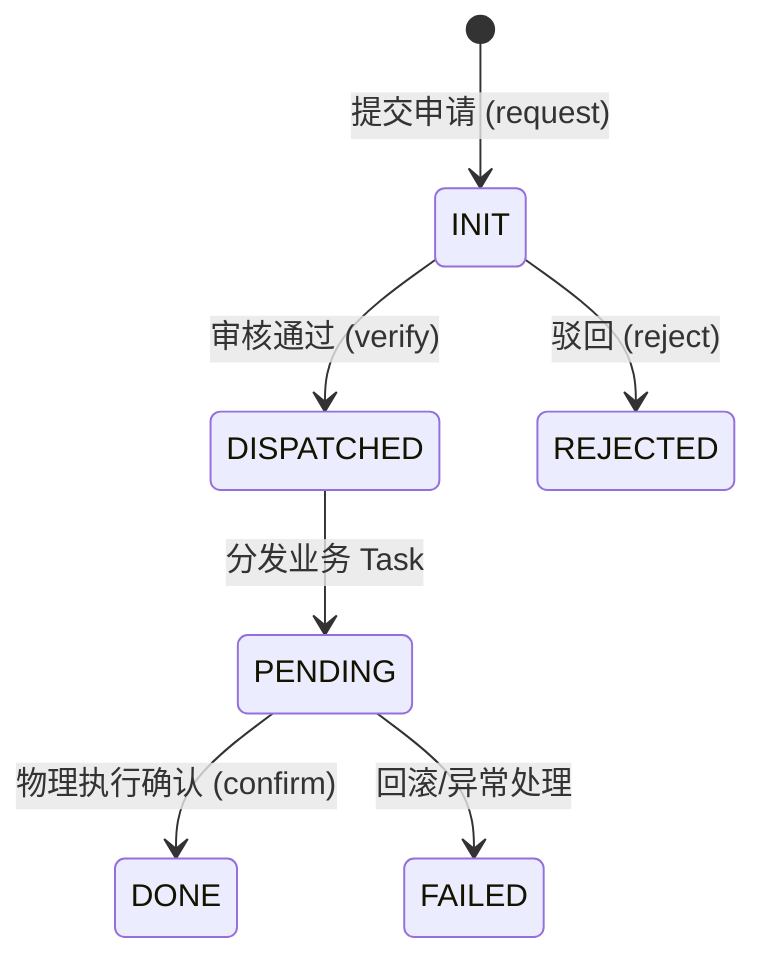

# Solo Approval Protocol (SAP) - 核心规范草案

> [!WARNING]
> **实现状态:部分实现(MVP)。** 已实现:`approval.record.{request,verify,confirm,reject,get,list}` 状态机(字段为 `state`)+ server-attested 证据链 + 禁止自审。**未实现**:多签(§7.2)、系统代理执行(§8)、规则引擎(§9)、真实 Ed25519 客户端签名。判断以 `CLAUDE.md` §2 / 代码为准。

## 1. 协议目标 (Purpose)
Solo Approval Protocol (SAP) 定义了一套标准化的异步审批与核实协议。旨在为分布式微服务提供一种**高度松耦合**、**操作透明**且具有**密码学不可否认性**的数据变更控制标准。

## 2. 核心设计哲学 (Design Philosophy)

### 2.1 三段式验证模型 (Triple-State Verification)
由于分布式系统中 Task 状态回传的不确定性，SAP 强制采用以下闭环流程：
1.  **审核 (Validation)**：指定用户（如部门主管）核准变更内容的正确性。
2.  **分发 (Dispatch)**：系统将审核通过的意图转化为具体的业务 Task 进行异步执行。
3.  **核实 (Confirmation)**：管理员（如总经理或实地人员）在物理层面确认执行结果已生效，并最终关闭协议。

### 2.2 松耦合与内容中立 (Data Agnostic)
- **非侵入性**：业务微服务无需感知 SAP。它们仅需提供原子化的 JSON-RPC 更新接口。
- **意图表达**：`Approval` 记录的是“变更意图”而非业务逻辑。这使得协议可以无缝支持未来创建的任何新微服务。

---

## 3. 协议数据标准 (Data Structures)

### 3.1 审批记录 (ApprovalRecord)
| 字段 | 类型 | 说明 |
| :--- | :--- | :--- |
| `id` | `uuid` | 协议实例唯一标识 |
| `target` | `string` | 目标实体表达式 (格式: `service:entity:id`) |
| `payload` | `Operation[]` | 具体的变更操作数组 |
| `state` | `enum` | 状态机标识: `INIT` / `DISPATCHED` / `PENDING` / `DONE` / `REJECTED`(`status` 被实体工厂保留给软删生命周期,故状态机用 `state`) |
| `evidence` | `object` | 包含时间戳、签名数据及公钥信息的存证对象 |

### 3.2 操作原子 (Operation)
`payload` 中的每一个元素描述一个具体的属性变更：
```json
{
  "op": "UPDATE | DELETE | ADD",
  "field": "字段路径 (如 price.amount)",
  "oldValue": "修改前的值",
  "newValue": "拟修改的值",
  "meta": { "desc": "该项变更的业务含义 (用于 AI 理解)" }
}
```

---

## 4. 协议状态机 (State Machine)



---

## 5. 协议方法 (Standard API Methods)

- `approval.record.request`: 用户发起变更申请，生成 `INIT` 记录。
- `approval.record.verify`: 具备审核权限的用户核准内容，并触发 Task 分发，状态转为 `DISPATCHED`。
- `approval.record.confirm`: **核心核实方法**。在确认物理执行成功后调用，附带执行存证，状态转为 `DONE`。
- `approval.record.reject`: 驳回申请（`INIT` / `DISPATCHED` → `REJECTED`），可附带 `reason`。
- `approval.record.get/list`: 标准的查询接口，支持按 `target` 定向筛选。

---

## 6. 权限与安全架构 (Security & Permission Layer)

为了确保协议的**松耦合**，SAP 不强制绑定特定的权限微服务（如 `Authority`），而是定义了一套标准的“权限提供者 (Permission Provider)”接口规范。

### 6.1 权限归口与 `core/user` 集成
SAP 默认深度集成 Solo 系统的中心化身份体系：
- **无感校验**：`Approval` 服务通过请求上下文（Context）中的 `user.permit` 对象进行权限判断。该对象由 `router` 在握手阶段从 `core/user` 缓存中提取并注入。
- **权限定义**：在 `user.permit.services` 中定义对 `approval.record` 相关方法的访问权。
- **针对 Target 的动态鉴权**：
  - `Approval` 服务会验证用户的 `permit` 是否包含对目标实体（如 `commodity:product`）的“审批权”。
  - 这种设计避免了 `Approval` 服务去主动调用 `Authority`，实现了**运行时解耦**。

### 6.2 Authority 的角色定位（可选组件）
在 SAP 架构中，`Authority` 服务被定位为“管理平面”而非“执行逻辑”：
- **管理态**：`Authority` 负责在后台配置复杂的权限逻辑，并将结果推送到 `core/user` 的 `permit` 中。
- **运行态**：`Approval` 服务仅与 `core/user` 的数据打交道。如果系统中没有 `Authority`，直接通过 `core/user` 修改 `permit` 依然能跑通审批流。

### 6.3 AI 辅助决策 (AI Decision Support)
- **预审机器人**：AI 根据 `payload` 的对比值进行风险测评（如：价格跌幅预警）。
- **语义理解**：结合 `meta.desc` 与历史数据，为总经理提供“推荐通过”或“重点关注”的建议。

### 6.4 密码学不可否认性 (Solana Wallet Signature)

> ⚠️ **Phase-2 设计，当前不可构建。** 本节描述的“用户级”Ed25519 客户端签名当前**无法落地**：`core/user` 采用 SHA-256 挑战-响应登录，**用户身份模型里没有用户密钥对**（参见 `governance.md` §2、`CLAUDE.md` §2）。系统中现有的 `tweetnacl`/`bs58`/`@solana/web3.js` 只服务于 **Router→微服务的传输层签名**（验证 `ROUTER_PUBLIC_KEY`），与终端用户无关。因此 approval 证据目前只能是 **server-attested**（`publicKey/signature = null`）。本节要先由 `core/user` 增加用户密钥对支持后才能实现，属 Phase-2 设计。

- **底层签名算法**：采用 **Ed25519** 算法（Solana 标准）。利用系统中已有的 `tweetnacl` 和 `bs58` 库实现，与现有的微服务握手协议保持一致，无需额外引入库。
- **签名内容 (Data to Sign)**：审核员对消息 `[id + hash(payload) + timestamp]`（UTF-8 编码字节流）进行签名。
- **存证结构 (Evidence Structure)**：
  ```json
  {
    "publicKey": "Base58 编码的公钥",
    "signature": "Base58 编码的 Ed25519 签名",
    "timestamp": 1700000000000,
    "method": "solana:ed25519"
  }
  ```
- **验证逻辑**：`Approval` 服务通过 `nacl.sign.detached.verify` 校验签名合法性，确立不可否认性。

---

## 7. 高级特性 (Advanced Features)

### 7.1 前向兼容性 (Future-Proofing)
- 协议对未来微服务是零修改接入的。
- 只要新服务满足 `service:entity:id` 的寻址规范，SAP 即可立即为其提供审批背书。

### 7.2 多重签名与过期 (Multi-sig & Expiry)
> ⚠️ **未实现(设计草案)**:本节描述的机制当前代码中尚无实现,approval 服务目前为 MVP。

- **多签支持**：支持 m-of-n 逻辑（如 3 人中有 2 人签名才生效）。
- **生存期管理**：支持 `expiresAt`，过期未核实的申请将自动失效，确保系统状态不产生悬挂。

---

## 8. 系统代理执行机制 (System Proxy Execution)

> ⚠️ **未实现(设计草案)**:本节描述的机制当前代码中尚无实现,approval 服务目前为 MVP。

为了解决分布式权限阻断问题（如：用户 A 无权直接修改微服务 B，但审批流需要修改 B），SAP 引入了“系统特权代理”模式。

### 8.1 受信任的执行上下文 (Trusted Context)
- **身份切换**：在 `CONFIRM` 阶段，任务的最终下发不再以“初始申请人”的名义，而是切换为具备全局权限的 **`SYSTEM_EXECUTOR`**。
- **特权通道**：该超级账户的 Token 具有 Router 层的全通权限，确保审批通过的操作能够物理落实到任何目标微服务。

### 8.2 凭证安全与审计
- **动态令牌**：`Approval` 服务通过内部秘密（Shared Secret）向 `core/user` 换取临时的系统级 Token，该 Token 周期性刷新。
- **追溯性**：虽然执行身份是超级账户，但 Task 的 Meta 信息中必须强制绑定原始 `Approval ID`。审计日志可以通过该 ID 溯源到最初的申请人以及最终签名授权的核实人。

### 8.3 锁闭逻辑
- 超级账户权限**仅限**于 SAP 协议定义的 `approval.record.confirm` 流程触发。禁止任何微服务在正常的 RPC 链路中直接调用该身份。

---

## 9. 规则引擎与策略强制 (Rule Engine & Policy Enforcement)

> ⚠️ **未实现(设计草案)**:本节描述的机制当前代码中尚无实现,approval 服务目前为 MVP。

为了增强审批的业务安全性，SAP 支持在微服务层面配置灵活的“强制规则”，对审批流进行二次约束。

### 9.1 规则类型 (Rule Types)
1.  **阈值规则 (Threshold Rules)**：
    *   例如：当 `price` 变动幅度超过 20% 时，自动将状态转为“高风险”，并强制要求至少 2 名审核员签名。
2.  **强制 AI 审计 (Mandatory AI Audit)**：
    *   定义特定字段（如 `specs` 或 `meta`）在 `verify` 前必须通过 AI 的逻辑一致性检测。
3.  **黑名单限制 (Immutability)**：
    *   规定某些核心字段（如 `id`, `serial_number`）永不允许通过审批流进行修改。
4.  **自动驳回 (Auto-rejection)**：
    *   根据预设策略（如：非工作时间发起的敏感变更）自动将申请标记为 `REJECTED`。

### 9.2 准入与自动化 (Rules & Automation)
协议支持根据 `target` 的特征（如：字段权重、变动幅度）自动挂载不同的审批强度。

### 9.3 动态匹配原理
在申请发起阶段，系统通过匹配机制确定适用于当前操作的保护规则。这种机制确保了：
- **一致性**：同类操作遵循相同的安全标准。
- **效率**：低风险操作可以自动进入精简流程，而高风险操作则强制执行多签与 AI 审计。
